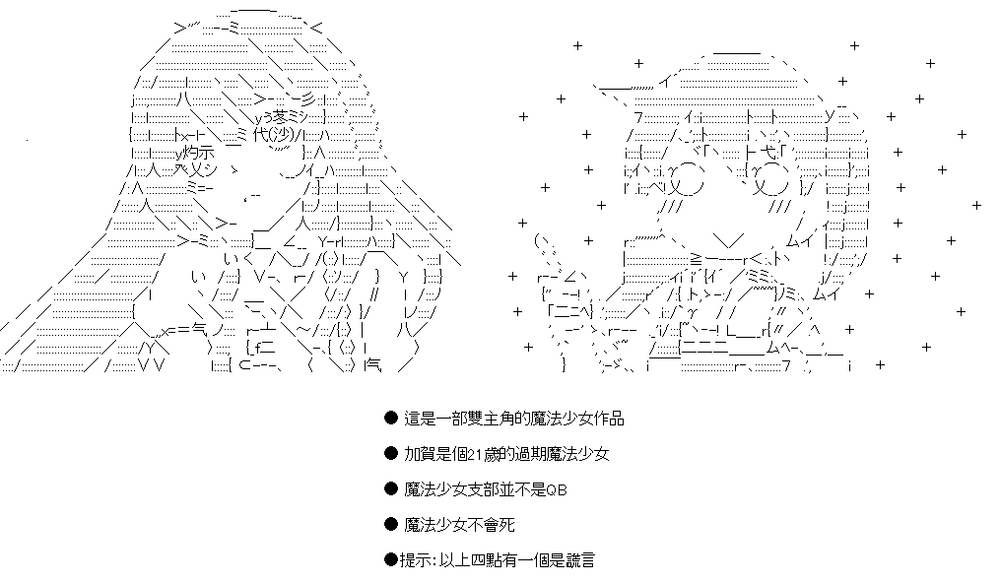

# 本傳

[序](/magicgirl/0.html)

[第1話](/magicgirl/1.html) 

[第2話](/magicgirl/2.html) 

[第3話](/magicgirl/3.html) 

[第4話](/magicgirl/4.html) 

[第5話 【調查！魔女的傳說！】](/magicgirl/5.html) 

[第5.5話 【日常回-少女的採訪】 ](/magicgirl/5.1.html) 

[第5.75話 【番外-揭示板寫作測試】 ](/magicgirl/5.2.html) 

[第一章-序 ](/magicgirl/6.0.html) 

[第6話](/magicgirl/6.1.html) 

[第7話](/magicgirl/7.html) 

[第8話](/magicgirl/8.html) 

[第9話](/magicgirl/9.html) 

[第10話](/magicgirl/10.html) 

[第10.5話【愛莉絲篇人物介紹】](/magicgirl/aliceintro.html) 

[第11話](/magicgirl/11.html) 

[第12話](/magicgirl/12.html)

[第13話](/magicgirl/13.html)

[第14話](/magicgirl/14.html)

[第15話](/magicgirl/15.html)

[第16話](/magicgirl/16.html)

[第17-1話](/magicgirl/17-1.html)

[第17-2話](/magicgirl/17-2.html)

[第17-3話](/magicgirl/17-3.html)

[第17話_完](/magicgirl/17-end.html)

[第18話](/magicgirl/18.html)

[第19-1話](/magicgirl/19-1.html)

[第19-2話](/magicgirl/19-2.html)

[第19-3話](/magicgirl/19-3.html)

[第19話_完](/magicgirl/19-end.html)

[第20話_序](/magicgirl/20-0.html)

# 外傳

番外短篇

[第7話的小小後續](/magicgirl/7.1.html) 

[島風的日常](/magicgirl/short1.html) 

[魔女的一日](/magicgirl/short2.html) 

[小圓與友人的日常](/magicgirl/short3.html) 

[安價短篇：不可以色色，魔法師公會員工健檢騷動](/magicgirl/short4.html) 

[安價短篇：魔法少女支部的宣傳採訪](/magicgirl/short5.html) 

[安科短篇：為妳製作的滋味](/magicgirl/short6.html) 

[安價短篇：魔法少女支部的料理競賽](/magicgirl/short7.html)

[安科短篇：瑪莉老師的手把手料理教室](/magicgirl/short8.html) 

外傳一：見習魔女南宮那月

(外傳一建議閱讀順序：本篇1-10話->外傳第1話->第2話->第3話->第4話->外傳二-序->最終話->完結人物介紹->本篇11話以後)

[第1話](/magicgirl/bf1.html) 

[第2話](/magicgirl/bf2.html) 

[第3話](/magicgirl/bf3.html) 

[第4話](/magicgirl/bf4.html) 

[最終話](/magicgirl/bf5.html) 

[完結人物介紹](/magicgirl/BFINTRO.html) 

外傳二：實習魔法師愛莉絲

[序](/magicgirl/OUT2-0.html) 
