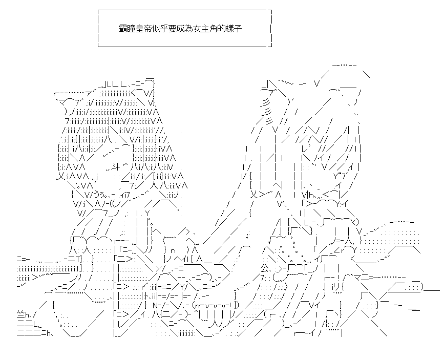

[創角劇情](0.md) 

[序章](/princess/0.5.html)

[第1話   【何為公主?】](/princess/1.html) 

[第2話   【藥草採集】](/princess/2.html) 

[第3話   【雷歐的報恩】](/princess/3.html) 

[第4話   【製作料理要投入愛情】](/princess/4.html) 

[第4.5話   【調查吧！綠龍骸領！】](/princess/4-5.html) 

[第5話   【真物與偽物】](/princess/5.html) 

[第6話   【人魚姬的二重身】](/princess/6.html) 

[第7話   【"心"的碎片】](/princess/7.html) 

[第8話   【理應迎來的幸福結局】](/princess/8.html) 

[第8.5話   【馬提爾德岩峰 北部】](/princess/8-5.html) 

[第9話   【他與她的終末決戰】](/princess/9.html) 

[第10話 【羈絆的型態】](/princess/10.html) 

[第11話 【為了有朝一日的歡樂餐桌】](/princess/11.html) 

[第12話 【那是想成為公主的少女的物語】](/princess/12.html) 

[Eplogue 【今天，少女們依然向著未來前進】](/princess/END.html) 
