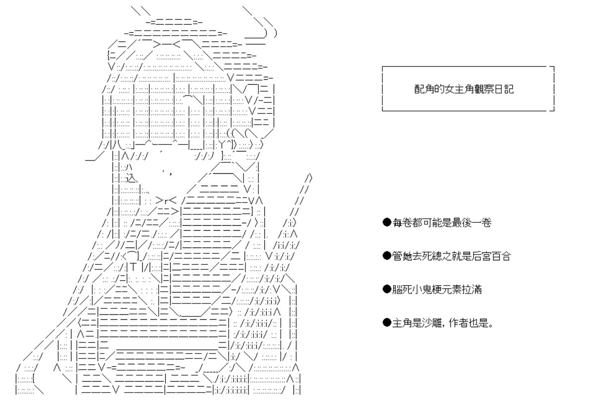

# 本傳

[序_角色創建](/zako/0.html)

[第1話：我叫雜魚醬，是個學生](/zako/1.html) 

[第2話：草，我成配角了](/zako/2.html) 

[第3話：我排除了大部分的裝逼，但我保留了一部分](/zako/3.html) 

[第4話：序關BOSS竟成了魔法少女](/zako/4.html) 

[第5話：最帥氣的魔法少女](/zako/5.html) 

[第一卷尾聲：配角今日依舊在觀察著女主角](/zako/1-end.html) 

[第6話：青梅竹馬原來是妳啊！](/zako/6.html) 

[第7話：水月醬：「幫你把炸彈炸了，不用謝」](/zako/7.html) 

[第8話：未能給出的回答](/zako/8.html) 

# 短篇

[短篇：想隨便寫點百合所生的短篇](/zako/5.1.html) 
